# Virtualizing Cloudera Data using IBM Cloud Pak for Data

The purpose of this article is to highlight the ability of IBM Cloud Pak for Data to integrate with other market-leading data management platforms, such as Cloudera.

Due to the complexity of installing a Cloudera cluster, it is assumed the reader will already have access to a Cloudera instance. If not, you can still follow along and get insights into how integration can be accomplished.

## Topics

1. [Overview of technologies](#1-overview-of-technologies)
1. [Overview of our Cloudera Data Platform and IBM Cloud Pak for Data clusters](#2-overview-of-our-cloudera-data-platform-and-ibm-cloud-pak-for-data-clusters)
1. [Installing the IBM Execution Engine for Hadoop (HEE) on Cloudera Data Platform](#3-installing-the-ibm-execution-engine-for-hadoop-hee-on-cloudera-data-platform)
1. [Use HEE to configure Cloudera Data Platform connections](#4-use-hee-to-configure-cloudera-data-platform-connections)
    * [HDFS Connection](#-hdfs-connection)
    * [Hive Connection](#-hive-connection)
    * [Impala Connection](#-impala-connection)
1. [Load data on Cloud Pak for Data](#5-load-data-on-cloud-pak-for-data)
1. [Create Db2 connection to access data on Cloud Pak for Data](#6-create-db2-connection-to-access-data-on-cloud-pak-for-data)
1. [Load data on Cloudera Data Platform](#7-load-data-on-cloudera-data-platform)
1. [Use IBM BigSQL to synchronize data from Hive table into Cloud Pak for Data](#8-use-ibm-bigsql-to-synchronize-data-from-hive-table-into-cloud-pak-for-data)
1. [Access Cloudera data from Jupyter notebook running on Cloud Pak for Data](#9-access-cloudera-data-from-jupyter-notebook-running-on-cloud-pak-for-data)
1. [Use Data Virtualization to merge data from Cloudera and Cloud Pak for Data](#10-use-data-virtualization-to-merge-data-from-cloudera-and-cloud-pak-for-data)
1. [Build Cognos Analytics dashboard to visualize merged data](#11-build-cognos-analytics-dashboard-to-visualize-merged-data)

## 1. Overview of technologies

Let's start with some an overview of the technologies that we will be utilizing:

### Cloudera

[Cloudera](https://www.cloudera.com/) is the most popular Hadoop distribution, providing additional enterprise level support such as security, compliance and governance. The Cloudera platform uses analytics and machine learning to yield insights from data through a secure connection.

* [Apache Hadoop](https://hadoop.apache.org/): Using a collection of open-source projects, Hadoop provides a framework for distributed processing of large data sets across clusters. Data is stored using the Hadoop distributed file system (HDFS) and processed using MapReduce.

* [Cloudera Manager]() provides administration of your Cloudera cluster, including operations for installation, upgrading, and host management and monitoring.

* [Cloudera Data Platform]() (CDP) is Cloudera's solution for hybrid cloud and multi-cloud environments, making it easier for enterprises to run and move AI and analytics applications and data from one location to another. CDP offers cloud-native analytics for Data Engineering, Data Warehousing, and Machine Learning, running on public clouds as well as on-premises.

* [CDP Private Cloud]() built for hybrid cloud, connecting on-premises environments to public clouds. It provides a disaggregation of compute and storage, allowing for independent scaling of compute and storage clusters. Analytics running on containerized compute nodes, scalable object store, and a secure data lake.

* [Apache Hive](https://hive.apache.org/) runs over the Hadoop framework and provides an SQL-like interface for processing and querying the HDFS data.

* [Hive on Tez](https://docs.cloudera.com/cdp-private-cloud-base/7.1.6/hive-introduction/topics/hive-on-tez.html) provides a SQL-based data warehouse system based on Apache Hive. It improves SQL query performance, security, and auditing capabilities.

* [Hadoop Execution Engine]() used to communicate with Hadoop.

* [Apache Impala](https://impala.apache.org/) is similar to Hive, but with low-latency and high concurrency it provides a better option for interactive computing.

* [Apache Knox](https://knox.apache.org/) is an application gateway for interacting with the REST APIs and UIs of Hadoop deployments. Knox presents consumers with one endpoint for access to all the required services across multiple Hadoop clusters.

* [IBM Execution Engine for Hadoop](https://www.ibm.com/docs/en/watson-studio-local/2.0.0?topic=iao-setting-up-execution-engine-apache-hadoop-work-watson-studio-local) this add-on provides integration of IBM Cloud Pak for Data with a Hadoop cluster. It enables data scientists to use CPD to securely explore Hadoop data without needing to move the data out of the Hadoop cluster.

### IBM Cloud Pak for Data

[IBM Cloud Pak for Data](https://www.ibm.com/products/cloud-pak-for-data) is a unified, pre-integrated data and AI platform that runs natively on [Red Hat OpenShift Container platform](https://www.openshift.com/products/container-platform). Services are delivered with an open and extensible cloud native platform for collecting, organizing, and analyzing data. It’s a single interface to perform end-to-end analytics with built-in governance. It also supports and governs the end-to-end AI workflow.

* [IBM Db2](https://www.ibm.com/analytics/db2) is a Relational Database Management System (RDBMS). Along with providing the Db2 relational database, it includes a family of tools that allows you to manage both structured and unstructured data across on-premises and multi-cloud environments.

* [IBM Big SQL](https://www.ibm.com/docs/en/db2-big-sql/5.0.2?topic=overview) provides a single database connection to query data across Hadoop and other relational/NoSQL databases. Data can reside on local systems or on the cloud.

* [Data Virtualization]() can query data across many systems without having to copy and replicate data. Is accurate because you’re querying the latest data at its source.

* [IBM Cognos Analytics Dashboard](): self-service analytics, infused with AI and machine learning, enable you to create stunning visualizations and share your findings through dashboards and reports.

## 2. Overview of our Cloudera Data Platform and IBM Cloud Pak for Data clusters

### CDP installation and configuration

The version of CDP we are using is `7.1.6`.

Here is the environment that we have configured for our CDP Private Cloud instance:

#### CDP cluster nodes

We provisioned an 8 node cluster on IBM Cloud to host our CDP instance.

We also provisioned two additional virtual servers -- one for a [bastion node](https://en.wikipedia.org/wiki/Bastion_host) so that we could easily SSH into all the other nodes, and the other for an Active Directory Server to manage authentication for our cluster.

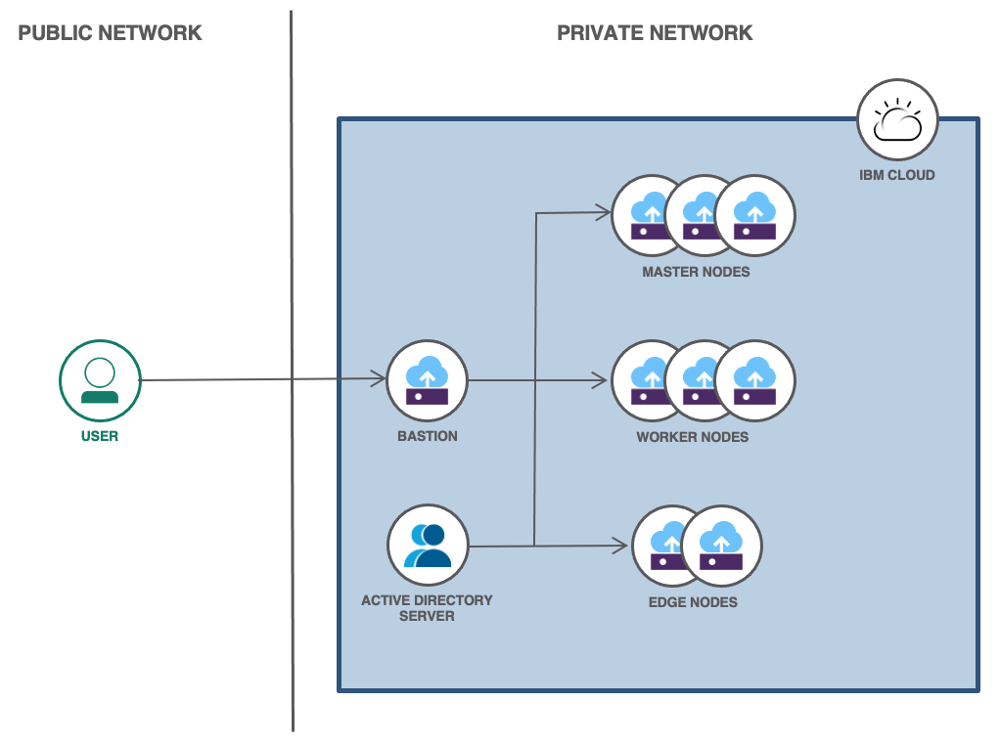

Here are the nodes listed in our IBM Cloud devices list:

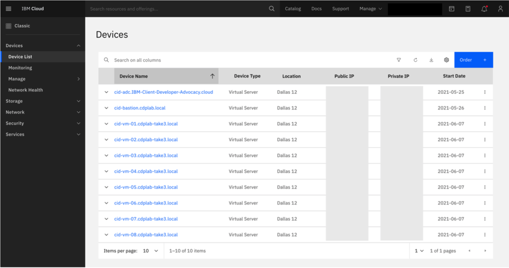

* `cid-bastion` is our bastion node
* `cid-adc` is our Active Directory Server node
* `cid-vm-01` to `cid-vm-03` are our master nodes
* `cid-vm-04` to `cid-vm-06` are our worker nodes
* `cid-vm-07` and `cid-vm-08` are our edge nodes

Each was provisioned with 32 vCPU and 128GB of RAM running CentOS.

##### Active Directory Server

We set up an Active Directory Server [`cid-adc`] on Windows 2019 Server to manage access to our Cloudera base installation. This includes Active Directory Domain Services and a DNS server -- we created a private DNS domain named `cdplab.local`. We added DNS entries for each VM in our CDP cluster. This is also where we define our Active Directory and domain users.

As part of the CDP install, each Active Directory user will be provided an HDFS home directory.

#### Cloudera Manager

We manage our CDP using Cloudera Manager running on `cid-vm-01`.

Here you see our `cpdlab` cluster and list of hosts:

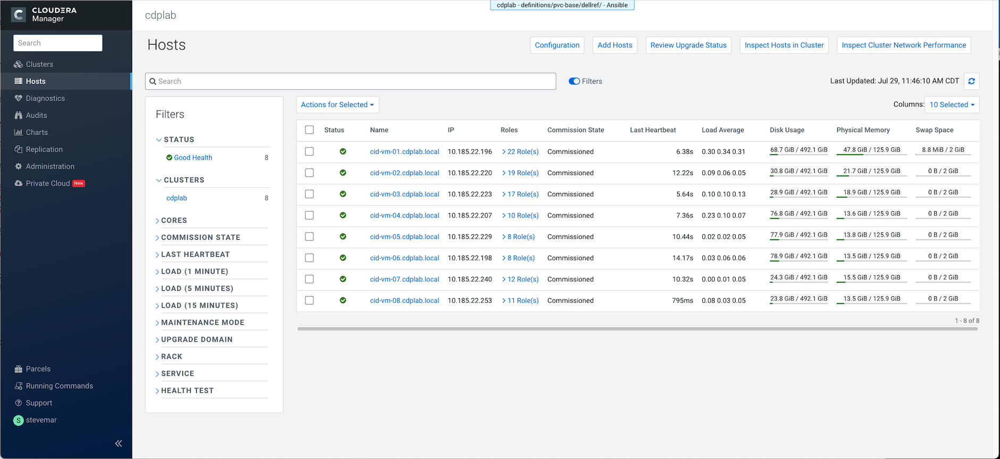

Here is the list of services available on the cluster:

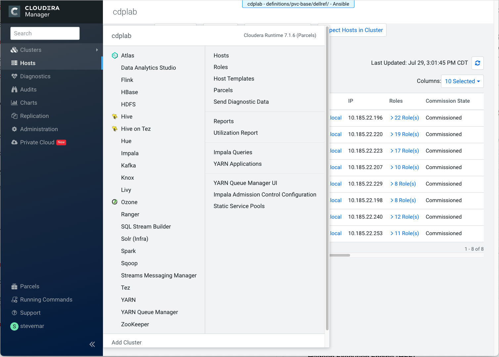

### IBM CP4D installation and configuration

We are running CP4D version 3.5 that we provisioned from IBM Cloud.

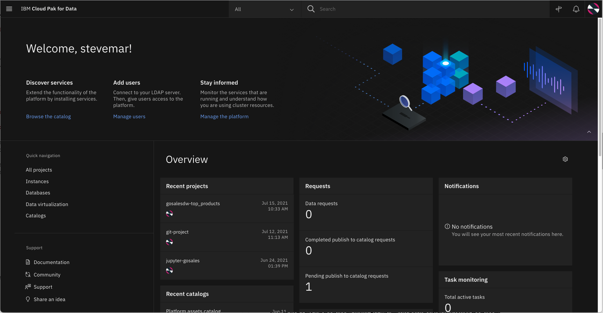

CP4D comes pre-packaged with a host of tools and services that can be instantiated. We provisioned Data Virtualization, Streams, and Cognos Analytics.

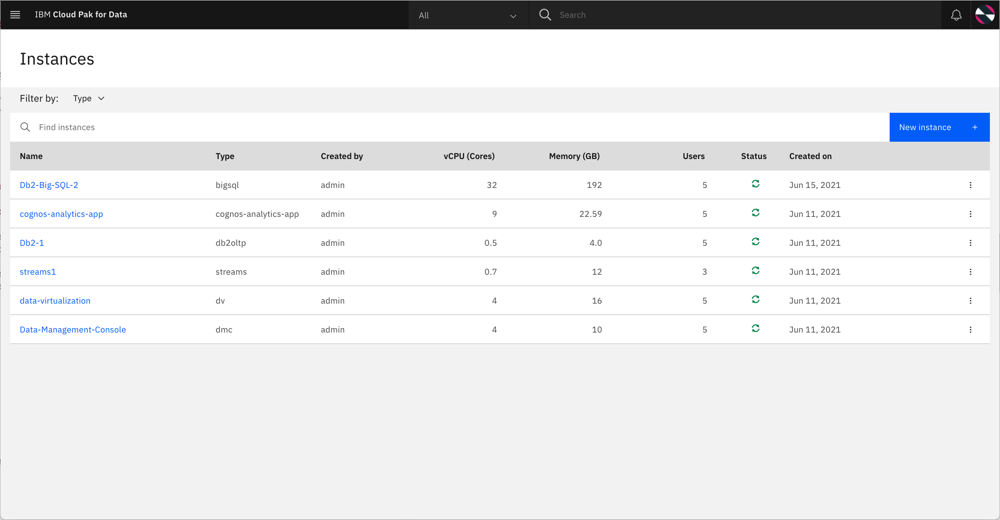

## 3. Installing the IBM Execution Engine for Hadoop (HEE) on Cloudera Data Platform

To access data on the Cloudera edge nodes from CP4D, we need to install the IBM Execution Engine for Hadoop. We did this on our Cloudera cluster edge nodes `cid-vm-07` and `cid-vm-08`.

>*NOTE*: The reference documentation and package names may use terms like Watson Studio or DSX. These are previous brand names for Cloud Pak for Data.

There are several steps involved with this task:

* From the Cloudera Manager home page, click the `Configuration` drop-down menu, and select `Advanced Configuration Snippets`.

    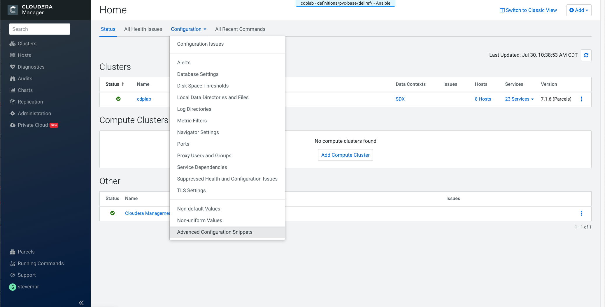

* To get to the right settings, search on `core-site.xmd`.

    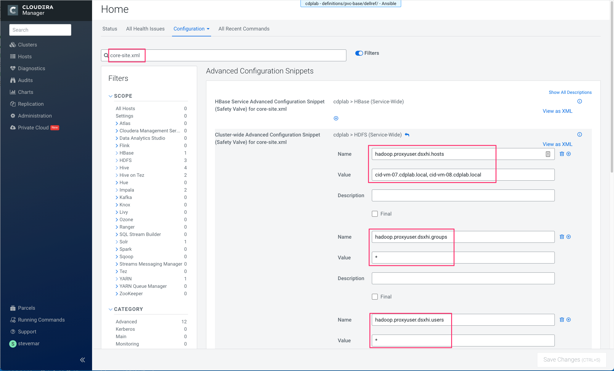

    On the HBase Service settings panel, add entries for:

    * hadoop.proxyuser.dsxhi.hosts (set value to the names of the edge nodes)
    * hadoop.proxyuser.dsxhi.groups
    * hadoop.proxyuser.dsxhi.users

* Ensure the HiveServer2 instance is running in the `Hive on Tez` service. To verify, select `Hive on Tez` entry in the main service list for your cluster. Then select `Instances`.

    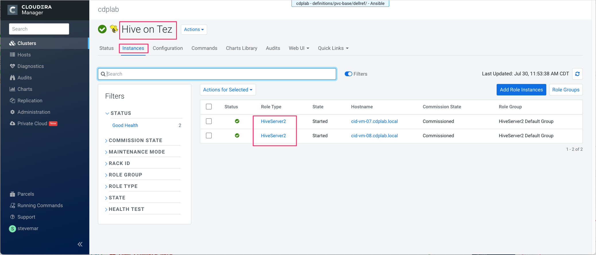

  This is required because the HEE calls the HiveServer2 endpoint to get information about Hive.

* Install the IBM Execution Engine package on both of the edge nodes.

  Here is a link to the RPM package: !!need link!!

  After installing the package, you will need to run the `manage_known_dsx.py` utility to add the edge node to the managed list. This will return you a `Service URL` that is required for the next step.

* From the CP4D console, select the `Platform configuration` option under `Administration`.

    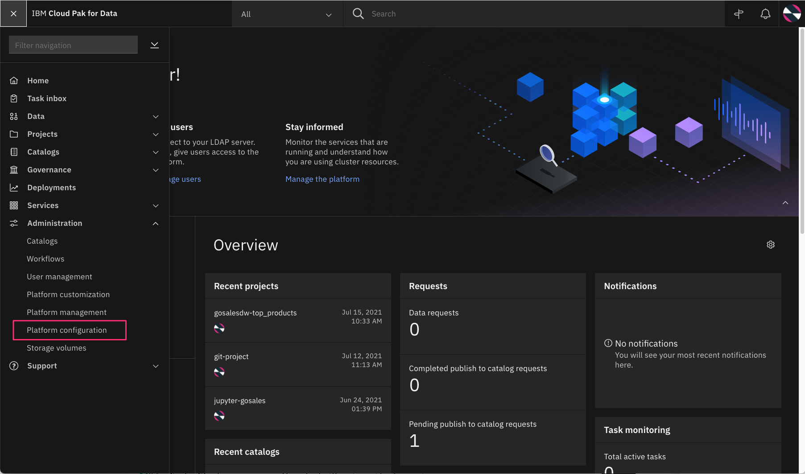

* From the `Platform configuration` panel, select the `System Integration` tab. To add our 2 edge nodes, click `New integration` and add the nodes.

    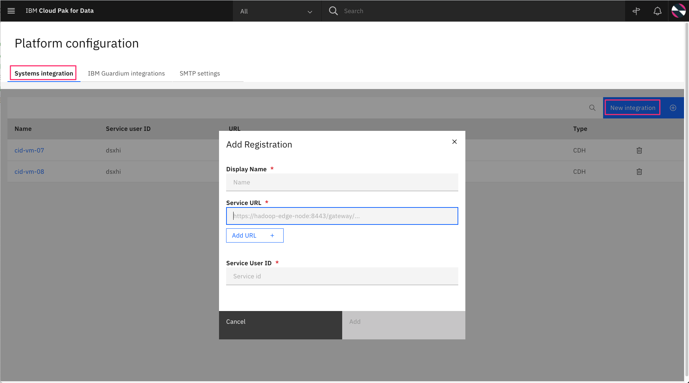

* From the `Add Registration` dialog, enter the `Service URL` you collected from the last step. For `Display Name`, enter a unique name for your edge node. For `Service User ID`, enter `dsxhi`.

  ?? is service user id set during install of HEE?

  When complete, each of your edge nodes should have an entry similar to the how we added our two edge nodes (`cid-vm-07` and `cid-vm-08`).

    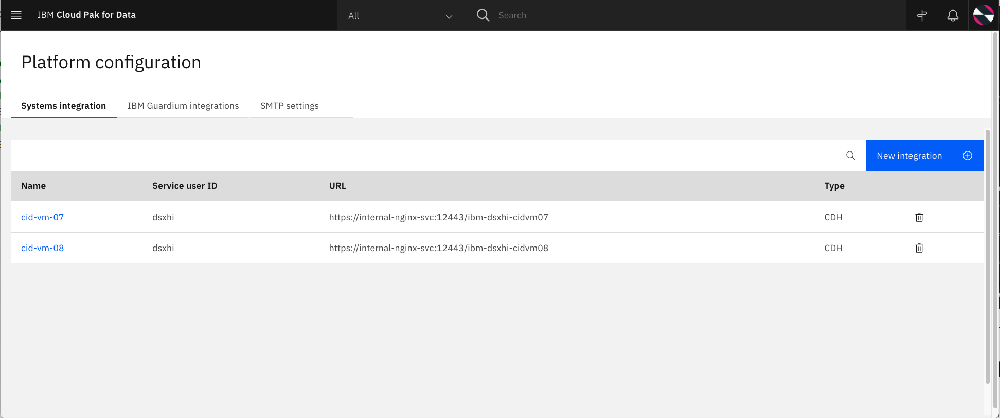

  Click on one of the edge node entries to get details.

    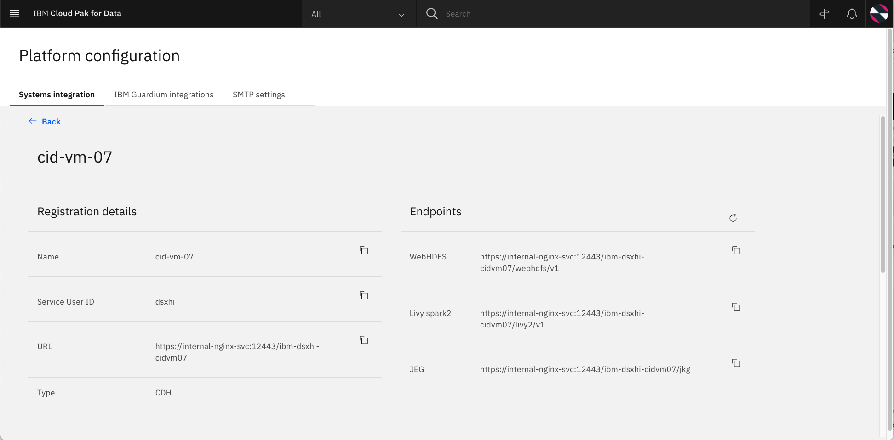

    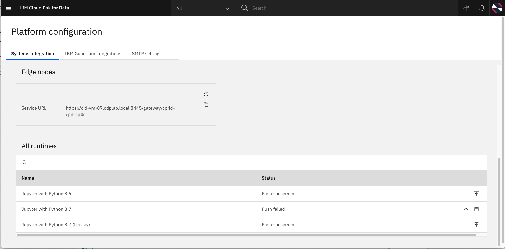

  >*Note*: that these values will be needed when we run our CPD notebook that accesses data on Cloudera.

## 4. Use HEE to configure Cloudera Data Platform connections

These tasks require you log in as `admin` on your CPD console.

From the main menu, select `Data` and then `Platform connections`.

[add-screen-shot of current connections]()

Click `New connection`.

[add-screen-shot of connection options]()

Use this panel as the starting point for creating the following connections.

### HDFS Connection

First, let's create an HDFS via Execution Engine for Hadoop connection. Click [here](https://www.ibm.com/support/producthub/icpdata/docs/content/SSQNUZ_latest/wsj/manage-data/conn-hadoop-hdfs.html) for details on how to configure it and the benefits it provides.

Essentially, this connection will allow us to access HDFS data in a Hadoop cluster (i.e. Cloudera).

From the new connection screen, in the IBM list of connection options, select `HDFS via Execution Engine for Hadoop`.

[add-screen-shot]()

From the panel, enter a unique connection name, like `hdfs-hee`.

For the `WebHDFS URL`, get the value from the `Platform configuration` details for your edge node.

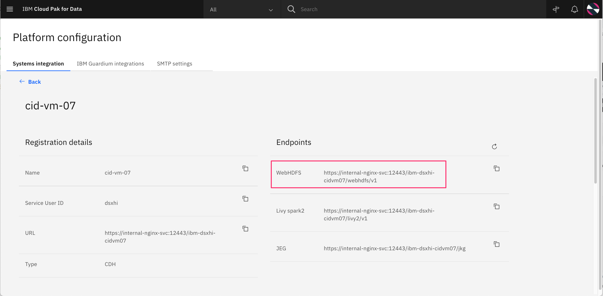

Turn on the options to:
* `Use your Cloud Pak for Data credentials to authenticate to the data source`.
* `User home directory is used as the root of browsing`.

For the SSL certificate, you need to return log into your edge node, then run the `openssl` command with the `-showcerts` option on the default port `8443`. Copy and paste the returned certificate into the `Certificates` text field.

Click the `Create` button.

After the connection is created, you can click on new connection to see the details. You can also click the `Test` button to try out the connection.

### Hive Connection

Next, let's create a Hive via Execution Engine for Hadoop connection. Click [here](https://www.ibm.com/support/producthub/icpdata/docs/content/SSQNUZ_latest/wsj/manage-data/conn-hadoop-hive.html) for details on how to configure it and the benefits it provides.

Essentially, this connection will allow us to access tables in a Hive warehouse on a Hadoop cluster (i.e. Cloudera).

From the new connection screen, in the IBM list of connection options, select `Hive via Execution Engine for Hadoop`.

[add-screen-shot]()

From the panel, enter a unique connection name, like `hive-hee`.

For the `Jars url` field, click `Upload new file`. Select Hive jdbc v4.1 jar that you downloaded earlier to your local file directory. ????

For the `Hadoop Integration URL`, get the value from the `Platform configuration` details for your edge node.

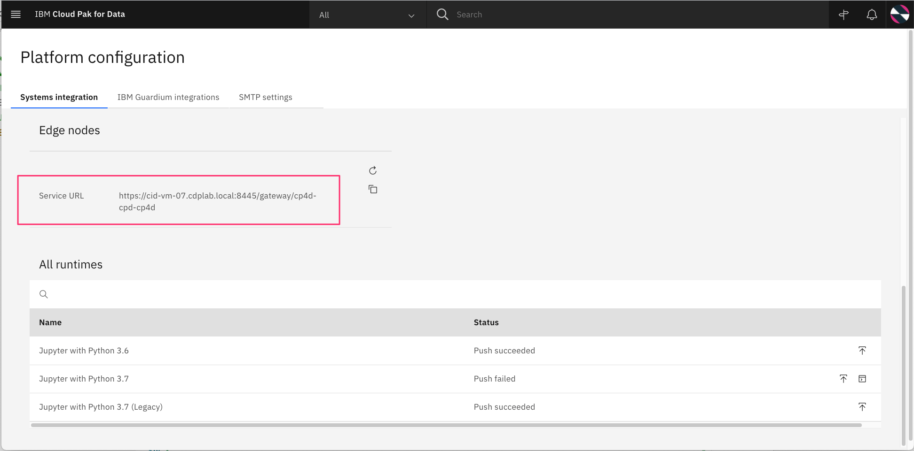

Turn on the option to `Use your Cloud Pak for Data credentials to authenticate to the data source`.

For the SSL certificate, you need certificates for both the edge node and the Hive server. For the edge node, repeat the steps you used for the previous connection -- using `openssl` command on default port `8443`. Copy and paste the returned certificate into the `Certificates` text field.

For the Hive server certificate, you need to run the `openssl` command on the system hosting the Hive server. To get the port number, go to the `HiveServer2` instance panel in the Cloudera Manager, and search on `port`.

Notice that we looking at the `HiveServer2` panel running on edge node `cid-vm-07`. The port number is set to `10000`.

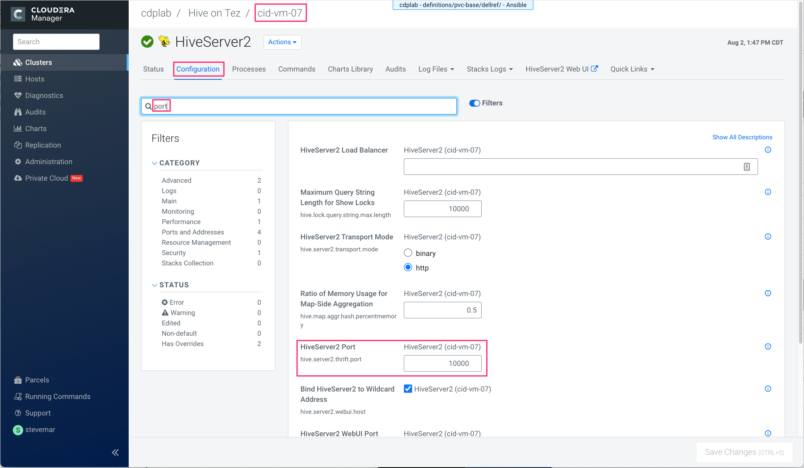

Copy and append the returned certificate into the `Certificates` text field.

Click the `Create` button.

After the connection is created, you can click on new connection to see the details. You can also click the `Test` button to try out the connection.

### Impala Connection

Next, let's create an Impala via Execution Engine for Hadoop connection. Click [here](https://www.ibm.com/support/producthub/icpdata/docs/content/SSQNUZ_latest/wsj/manage-data/conn-hadoop-impala.html) for details on how to configure it and the benefits it provides.

Essentially, this connection will allow us to access data stored in tables in Impala on a Hadoop cluster (i.e. Cloudera).

Before we create the connection, we must first configure Impala with LDAP. From the Cloudera Manager, select the `Impala` service, the click on `Configuration`.

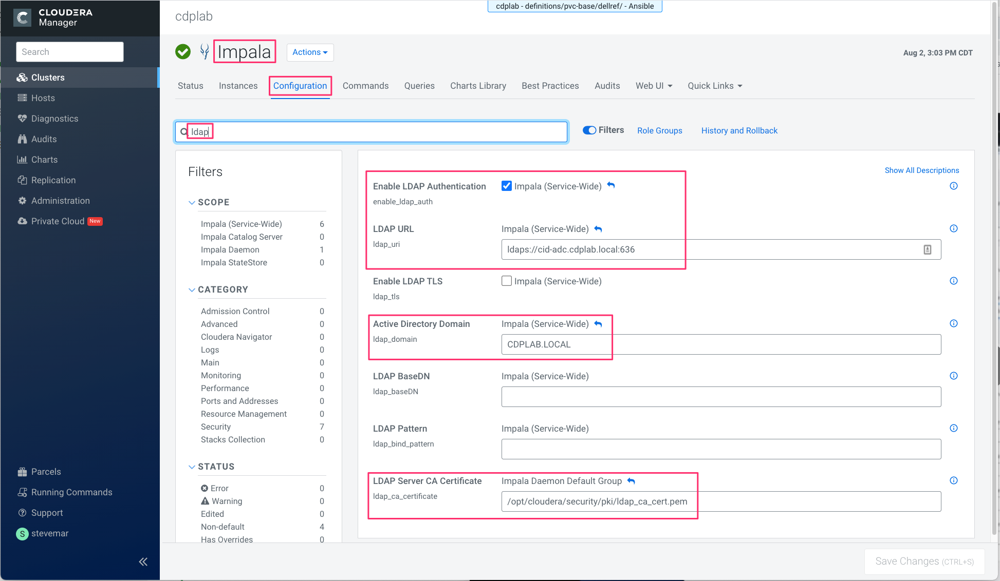

Select `Enable LDAP Authentication`, then enter the URL and port (`636` is the default for secure LDAP), and domain for your Active Directory server. Lastly, add the `pem` file containing your LDAP CA certificate.

Save your changes, then restart the Impala service.

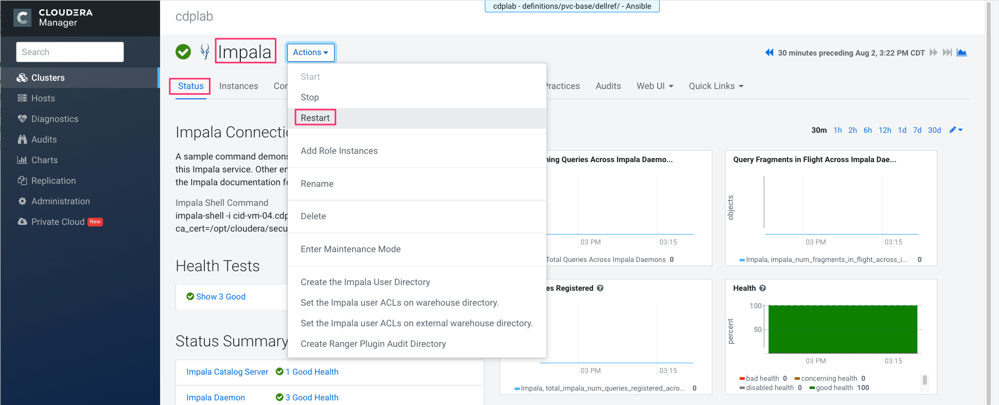

Once complete, we can move on to creating the connection. From the new connection screen, in the IBM list of connection options, select `Impala via Execution Engine for Hadoop`.

[add-screen-shot]()

From the panel, enter a unique connection name, like `impala-hee`.

For the `Hostname or IP Address` field, you need to enter a host on the Cloudera cluster that is running the Impala daemon. From the Cloudera Manager, select the `Impala` service, then click on `Instances`.

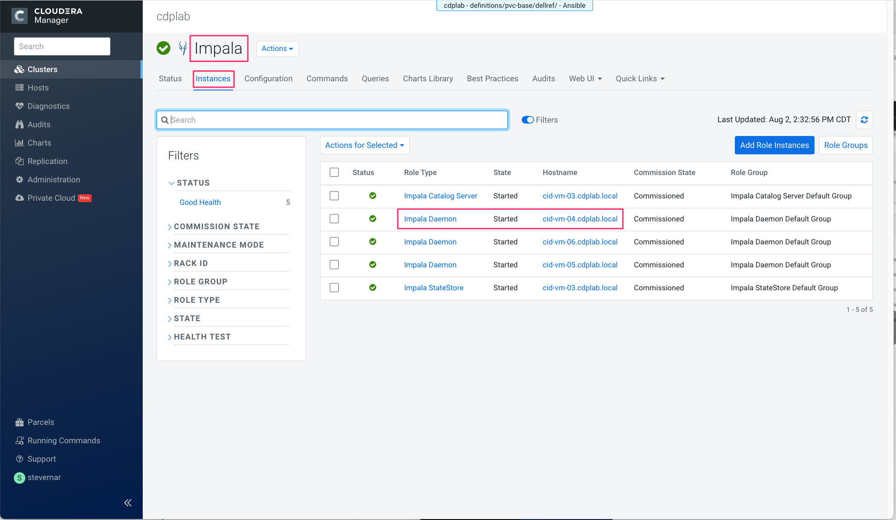

For `Port`, search on `Impala Daemon HiveServer2 Port` in the `Impala` service `Configuration` panel. The default value is `21050`.

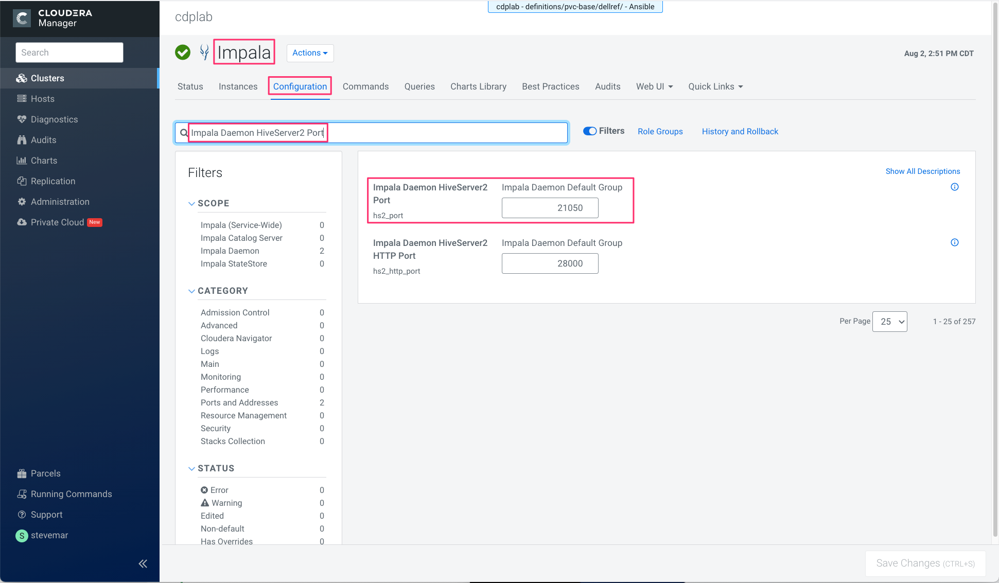

For the `Jars url` field, click `Upload new file`. Select Impala jdbc v4.1 jar that you downloaded earlier to your local file directory. ????

For credentials, enter your Active Directory user name and password.

For the SSL certificate, you need to return log into your cluster node that is running the Impala daemon, then run the `openssl` command with the `-showcerts` option on the default port `21050`. Copy and paste the returned certificate into the `Certificates` text field.

Click the `Create` button.

After the connection is created, you can click on new connection to see the details. You can also click the `Test` button to try out the connection.

Once all of our connections have been created and tested, our `Platform connections` list should look similar to this:

[add-screen-shot]()

## 5. Load data on Cloud Pak for Data

On the Cloud Pak for Data cluster, we will add our data into a Db2 instance. The data is transactional, such as profit, revenue, sales price

The Db2 service has been provisioned in our Cloud Pak for Data instance. To view it, from the main Cloud Pak for Data menu, select `Services`, and then click on `Instances`.

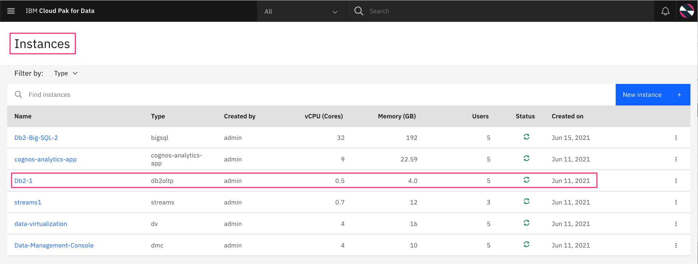

Click on the Db2 instance name to bring up the details panel. Click on the `Open database` button in the top right corner.

From the summary panel, click `Load Data`.

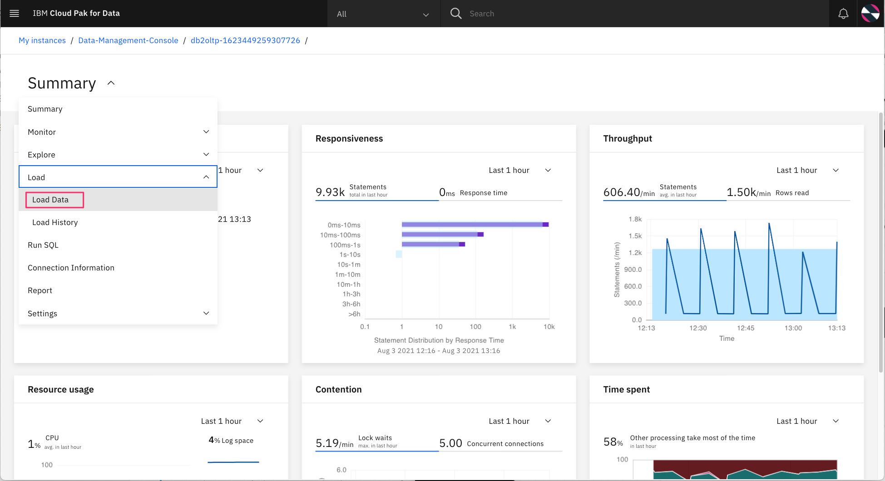

From the `File selection` window, upload the product data from a CSV file. NEED DATA FILE!!!!

CREATE TABLE
Schema - GREAT_OUTDOORS
Table - SALES

ADD NEW `DB2` CONNECTION

## 6. Create Db2 connection to access data on Cloud Pak for Data

After creating the data, we need to create a new connection to access it. Note that this task requires you to log in as `admin` on your CPD console.

From the main menu, select `Data` and then `Platform connections`.

[add-screen-shot of current connections]()

Click `New connection`.

[add-screen-shot of connection options]()

From the new connection screen, in the IBM list of connection options, select `Db2`.

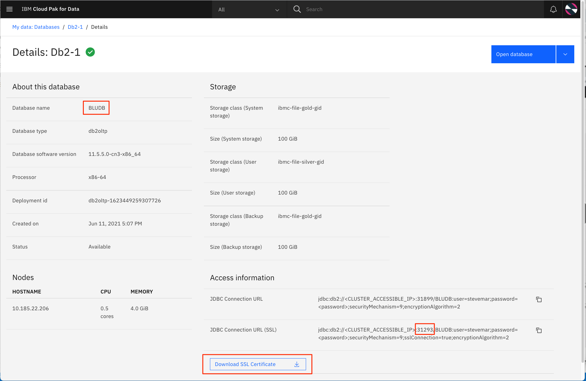

## 7. Load data on Cloudera Data Platform

On the Cloudera side, we will use Hive to populate our Hadoop tables. In our example, the data will be related to products (brand, description, price, ID, etc.).

First we need to do some setup to connect to our Hive service.

* Download the hive configuration file by selecting the `Download Client Configuration` option listed under the `Actions` drop-down menu for our Cloudera `Hive on Tez` service.

    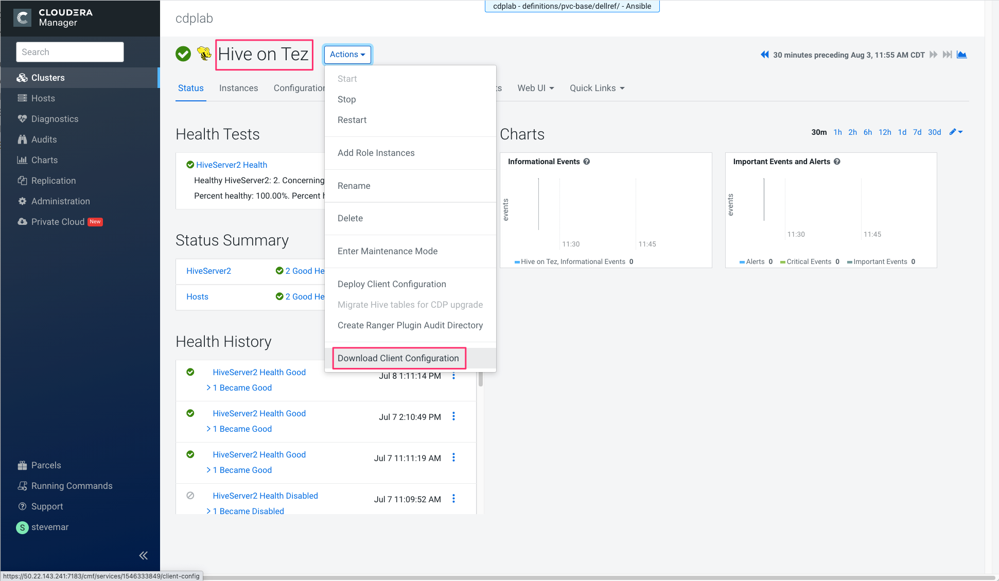

  This action will download a Hive configuration zip file. Unzip the file, then `cd` into the `hive-conf` directory to locate the `beeline-site.xml` file.

  Open the file and find the URL associated with the property `beeline-hs2-jdbc-url-hive_on_tez`. Copy and paste this value and then exit the file.

* Log into one of the master nodes in your CPD cluster.

  Start the beeline CLI by typing:
  
  ```bash
  beeline
  ```

  Connect to the Hive service by typing:
  
  ```bash
  !connect <jdbc-url>  // For `jdbc-url`, use the value copied from the previous step
  ```

* Use the following SQL commands to create a new database and tables.

  ```bash
  CREATE DATABASE great_outdoors_2;
  CREATE TABLE great_outdoors_2.products (
    `Product_number` STRING,
    `Product_line` STRING,
    `Product_type` STRING,
    `Product` STRING,
    `Introduction_date` STRING,
    `Product_brand` STRING,
    `Product_color` STRING,
    `Product_size` STRING,
    `Product_description` STRING,
    `Unit_cost` STRING,
    `Unit_price` STRING)
    STORED AS ORC TBLPROPERTIES('transactional'='false');
  ```

* Add some data.

  ```bash
  GET STRINGS FROM STEVE
  ```

* Verify our tables.

  ```bash
  SELECT * FROM great_outdoors_2.products;
  ```

Schema - GREAT_OUTDOORS_DATA

Tables - BRANCHES, PRODUCTS, RETAILERS, SALES_REPS

Need to use `kinit` ???

## 8. Use IBM BigSQL to synchronize data from Hive table into Cloud Pak for Data
    
    - BigSQL in installed on CPD - named `Db2-Big-SQL-2`
    - To use virtualization, need to create a JDBC connection (port 443)
    - connection named `bigsql`

## 9. Access Cloudera data from Jupyter notebook running on Cloud Pak for Data

## 10. Use Data Virtualization to merge data from Cloudera and Cloud Pak for Data

### View data sources

See 2 connections to data. "bigsql" to connect to CDP data, and "db2-on-cpd" to connect to Db2 data.

### Add virtual objects

Use "Add Virtual Objects" button.

Connect "SALES" table in Db2 data with "PRODUCTS" table in Hive data.

With create a new virtualized view in your default schema of your project. These 2 new virtualized objects will be displayed.

### Join the 2 tables

Join "REVENUE", "PROFIT" and "Product number" from Db2 with "PRODUCT_NUMBER", "PRODUCT_TYPE" and "PRODUCT" from Hive. Use product number as key.

Use SQL editor to modify the default SQL query. Add "GROUP BY" statement.

Run the command.

New view should show the new virtualized table (HIGHEST_REVENUE_PRODUCTS).

Preview the new table.

## 11. Build Cognos Analytics dashboard to visualize merged data

### Add "Data server connection"

Set up URL to connect to data virtualization service on CPD

You will need to enter uname/pwd to complete

Load schema and metadata

### Create data module

Use data source just added

Select table that we want: HIGHEST_REVENUE_PRODUCTS

Save data module

### Build dashboard

Drag SALES_REVENUE
Add PRODUCT_TYPE

Change scatter plot to tree map

## Associated Videos

1. Set up Active Directory Server on Windows 2019 Server
    - needed for Cloudera Data Platform
    - services include Active Directory Domain Services and DNS server
    - uses private DNS domain (cdplab.local)
    - add DNS entries for each VM in CDP cluster (cid-vm-01.cpdlab.local to cid-vm-08)
2. Use Ansible playbooks to create Cloudera Private Cloud on VMs created in IBM Cloud
3. Setup edge nodes (07 & 08) so we can install Hadoop Execution Engine (HEE)
4. Configure Cloudera so we can install HEE on edge nodes
    - need to configure HIVE because HEE install calls the HIVE server
    - use RPM to yum install HEE on edge nodes
    - use CPD Platform configuration tab to integrate with edge nodes
5. Configure CPD Platform connections via HEE
    - for HDFS (requires webHDFS url, SSL cert for HEE). Named `hdfs-hee`.
    - for Hive (requires Hive JDBC41 driver, Hadoop Integration Service url, SSL cers for HEE and Hive server). Named `hive-hee`.
    - for Impala (requires Impala JDBC41 driver, link to Impala daemon running on Cloudera). Named `impala-hee`.
6. IBM Db2 on CPD
    - upload data (product data in csv)
    - create a Db2 connection (port 31293). Requires SSL cert.
    - connection is named `db2-on-cpd`
7. Hive
    - connect to Hive using command line
    - use Hive on Tez service found on Cloudera
    - data will be on Cloudera
    - uses `beeline` CLI to create database, create table and load data from csv
8. Use BigSQL to synchronize data from Hive table into CPD
    - BigSQL in installed on CPD - named `Db2-Big-SQL-2`
    - To use virtualization, need to create a JDBC connection (port 443)
    - connection named `bigsql`
9. Use CPD Data Virtualization
    - "add existing connection" to point to connectors `bigsql` and `db2-on-cpd`
    - virtualize tables:
      - PRODUCTS (bigsql) (rename to PRODUCTS_HIVE to avoid conflict)
      - PRODUCTS (db2-on-cpd)
    - Join the 2 tables by mapping PRODUCT name
10. Cognos integration

## License

This code pattern is licensed under the Apache Software License, Version 2.  Separate third party code objects invoked within this code pattern are licensed by their respective providers pursuant to their own separate licenses. Contributions are subject to the [Developer Certificate of Origin, Version 1.1 (DCO)](https://developercertificate.org/) and the [Apache Software License, Version 2](https://www.apache.org/licenses/LICENSE-2.0.txt).

[Apache Software License (ASL) FAQ](https://www.apache.org/foundation/license-faq.html#WhatDoesItMEAN)
