# Virtualizing Cloudera Data using IBM Cloud Pak for Data

The purpose of this article is to highlight the ability of IBM Cloud Pak for Data to integrate with other market-leading data management platforms, such as Cloudera.

Due to the complexity of installing a Cloudera cluster, it is assumed the reader will already have access to a Cloudera instance. If not, you can still follow along and get insights into how integration can be accomplished.

## Topics

1. [Overview of technologies](#1-overview-of-technologies)
1. [Overview of our Cloudera Data Platform and IBM Cloud Pak for Data clusters](#2-overview-of-our-cloudera-data-platform-and-ibm-cloud-pak-for-data-clusters)
1. [Load data on Cloud Pak for Data](#3-load-data-on-cloud-pak-for-data)
1. [Create Db2 connection to access data on Cloud Pak for Data](#4-create-db2-connection-to-access-data-on-cloud-pak-for-data)
1. [Load data on Cloudera Data Platform](#5-load-data-on-cloudera-data-platform)
1. [Use IBM BigSQL to synchronize data from Hive table into Cloud Pak for Data](#6-use-ibm-bigsql-to-synchronize-data-from-hive-table-into-cloud-pak-for-data)
1. [Use Data Virtualization to merge data from Cloudera and Cloud Pak for Data](#7-use-data-virtualization-to-merge-data-from-cloudera-and-cloud-pak-for-data)
1. [Build Cognos Analytics dashboard to visualize merged data](#8-build-cognos-analytics-dashboard-to-visualize-merged-data)

## 1. Overview of technologies

Let's start with an overview of the technologies that we will be utilizing:

### Cloudera

[Cloudera](https://www.cloudera.com/) is the most popular Hadoop distribution, providing additional enterprise level support such as security, compliance and governance. The Cloudera platform uses analytics and machine learning to yield insights from data through a secure connection.

* [Apache Hadoop](https://hadoop.apache.org/): Using a collection of open-source projects, Hadoop provides a framework for distributed processing of large data sets across clusters. Data is stored using the Hadoop distributed file system (HDFS) and processed using MapReduce.

* [Cloudera Manager]() provides administration of your Cloudera cluster, including operations for installation, upgrading, and host management and monitoring.

* [Cloudera Data Platform]() (CDP) is Cloudera's solution for hybrid cloud and multi-cloud environments, making it easier for enterprises to run and move AI and analytics applications and data from one location to another. CDP offers cloud-native analytics for Data Engineering, Data Warehousing, and Machine Learning, running on public clouds as well as on-premises.

* [CDP Private Cloud]() built for hybrid cloud, connecting on-premises environments to public clouds. It provides a disaggregation of compute and storage, allowing for independent scaling of compute and storage clusters. Analytics running on containerized compute nodes, scalable object store, and a secure data lake.

* [Apache Hive](https://hive.apache.org/) runs over the Hadoop framework and provides an SQL-like interface for processing and querying the HDFS data.

* [Hive on Tez](https://docs.cloudera.com/cdp-private-cloud-base/7.1.6/hive-introduction/topics/hive-on-tez.html) provides a SQL-based data warehouse system based on Apache Hive. It improves SQL query performance, security, and auditing capabilities.

* [Hadoop Execution Engine]() used to communicate with Hadoop.

* [Apache Impala](https://impala.apache.org/) is similar to Hive, but with low-latency and high concurrency it provides a better option for interactive computing.

* [Apache Knox](https://knox.apache.org/) is an application gateway for interacting with the REST APIs and UIs of Hadoop deployments. Knox presents consumers with one endpoint for access to all the required services across multiple Hadoop clusters.

* [IBM Execution Engine for Hadoop](https://www.ibm.com/docs/en/watson-studio-local/2.0.0?topic=iao-setting-up-execution-engine-apache-hadoop-work-watson-studio-local) this add-on provides integration of IBM Cloud Pak for Data with a Hadoop cluster. It enables data scientists to use CPD to securely explore Hadoop data without needing to move the data out of the Hadoop cluster. 

<<TODO: Do we need reference to IBM HEE?>>

### IBM Cloud Pak for Data

[IBM Cloud Pak for Data](https://www.ibm.com/products/cloud-pak-for-data) is a unified, pre-integrated data and AI platform that runs natively on the [Red Hat OpenShift Container platform](https://www.openshift.com/products/container-platform). Services are delivered with an open and extensible cloud native platform for collecting, organizing, and analyzing data. It’s a single interface to perform end-to-end analytics with built-in governance. It also supports and governs the end-to-end AI workflow.

* [IBM Db2](https://www.ibm.com/analytics/db2) is a Relational Database Management System (RDBMS). Along with providing the Db2 relational database, it includes a family of tools that allows you to manage both structured and unstructured data across on-premises and multi-cloud environments.

* [IBM Big SQL](https://www.ibm.com/docs/en/db2-big-sql/5.0.2?topic=overview) provides a single database connection to query data across Hadoop and other relational/NoSQL databases. Data can reside on local systems or on the cloud.

* [Data Virtualization]() can query data across many systems without having to copy and replicate data. Is accurate because you’re querying the latest data at its source.

* [IBM Cognos Analytics Dashboard](): self-service analytics, infused with AI and machine learning, enable you to create stunning visualizations and share your findings through dashboards and reports.

## 2. Overview of our Cloudera Data Platform and IBM Cloud Pak for Data clusters

### CDP installation and configuration

The version of CDP we are using is `7.1.6`.

Here is the environment that we have configured for our CDP Private Cloud instance:

#### CDP cluster nodes

We provisioned an 8 node cluster on IBM Cloud to host our CDP instance.

We also provisioned two additional virtual servers -- one for a [bastion node](https://en.wikipedia.org/wiki/Bastion_host) so that we could easily SSH into all the other nodes, and the other for an Active Directory Server to manage authentication for our cluster.


Here are the nodes listed in our IBM Cloud devices list:


* `cid-bastion` is our bastion node
* `cid-adc` is our Active Directory Server node
* `cid-vm-01` to `cid-vm-03` are our master nodes
* `cid-vm-04` to `cid-vm-06` are our worker nodes
* `cid-vm-07` and `cid-vm-08` are our edge nodes

Each was provisioned with 32 vCPU and 128GB of RAM running CentOS.

##### Active Directory Server

We set up an Active Directory Server [`cid-adc`] on Windows 2019 Server to manage access to our Cloudera base installation. This includes Active Directory Domain Services and a DNS server -- we created a private DNS domain named `cdplab.local`. We added DNS entries for each VM in our CDP cluster. This is also where we define our Active Directory and domain users.

As part of the CDP install, each Active Directory user will be provided an HDFS home directory.

#### Cloudera Manager

We manage our CDP using Cloudera Manager running on `cid-vm-01`.

Here you see our `cpdlab` cluster and list of hosts:


Here is the list of services available on the cluster:


### IBM CP4D installation and configuration

We are running CP4D version 3.5 that we provisioned from IBM Cloud.


CP4D comes pre-packaged with a host of tools and services that can be instantiated. We provisioned Data Virtualization, Db2, Big SQL, and Cognos Analytics.


## 3. Load data on Cloud Pak for Data

On the Cloud Pak for Data cluster, we will add our data into a Db2 instance. The data is transactional, such as profit, revenue, sales price

The Db2 service has been provisioned in our Cloud Pak for Data instance. To view it, from the main Cloud Pak for Data menu, select `Services`, and then click on `Instances`.


Click on the Db2 instance name to bring up the details panel. Click on the `Open database` button in the top right corner.

From the summary panel, click `Load Data`.


From the `File selection` window, upload the `Sales` CSV file from our [data directory](data/Sales.csv), then click `Next`.

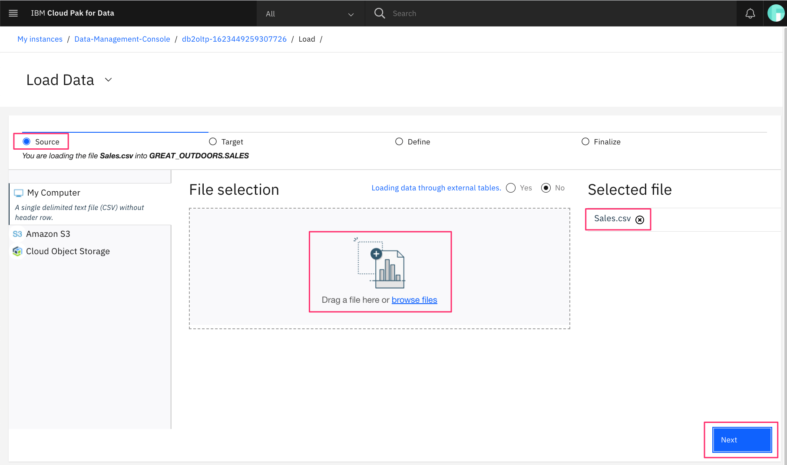

To create a new `sales` table, select the `GREAT_OUTDOORS` schema, and then click the `New table +` button. Enter `SALES` as the new table name and then click `Create`. 

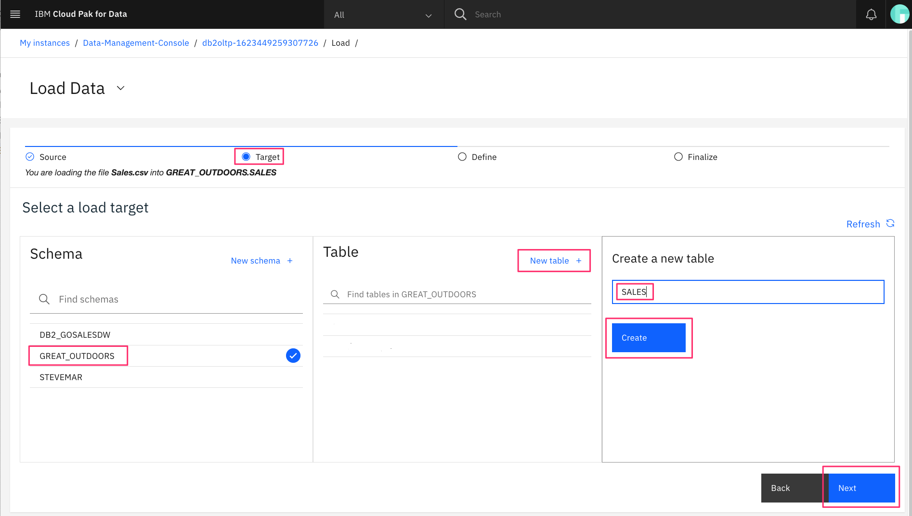

Once our table is created, click `Next`.

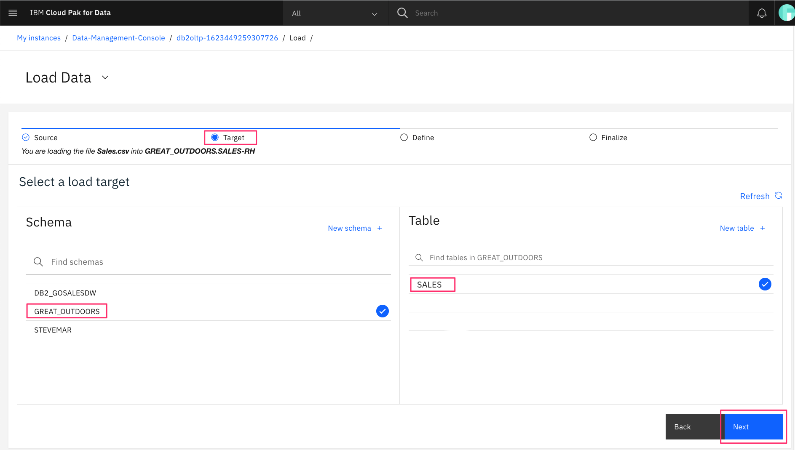

You can then view all of the data rows that will be uploaded into our new `SALES` table.

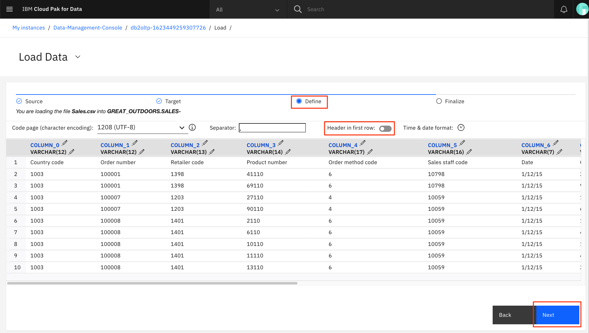

Note that you can toggle the `Header in first row` button to view the column header names.

Click `Next` to start the loading of the data.

<<TODO: Add screen shot of loading>>

## 4. Create Db2 connection to access data on Cloud Pak for Data

After creating the data, we need to create a new connection to access it. Note that this task requires you to log in as `admin` on your CPD console.

From the main menu, select `Data` and then `Platform connections`.

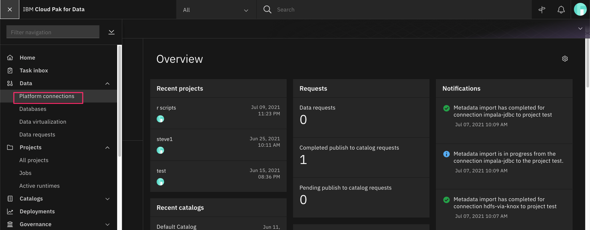

From the `Platform connections` panel, click `New connection`.

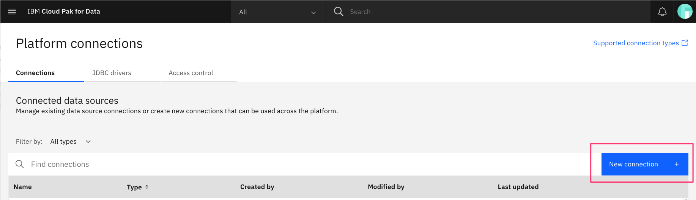

From the `New connection` panel, in the IBM list of connection options, select `Db2`.

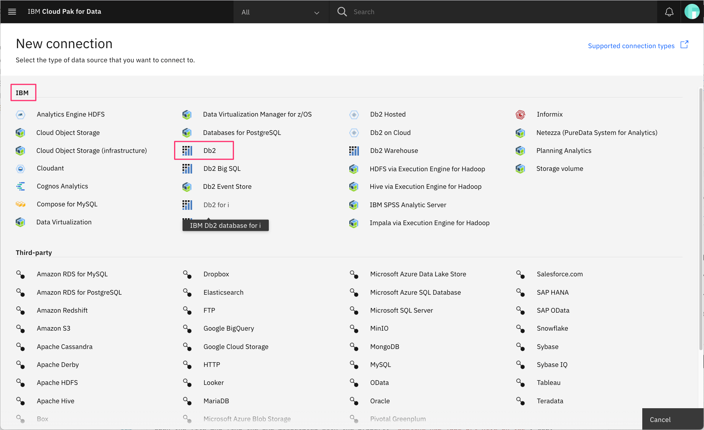

To fill in the data for the new connection, take the values from the following 2 panels:

1. **Panel 1**: The Db2 instance panel, which you can navigate to by selecting `Services` and then `Instances` from the main menu on the CPD Home page, and then clicking on the `Db2` instance name.

    

2. **Panel 2**: The Db2 instance connection information panel. From the previous details page, click on `Open database`, then select `Connection Information` from the `Summary` drop-down menu.

    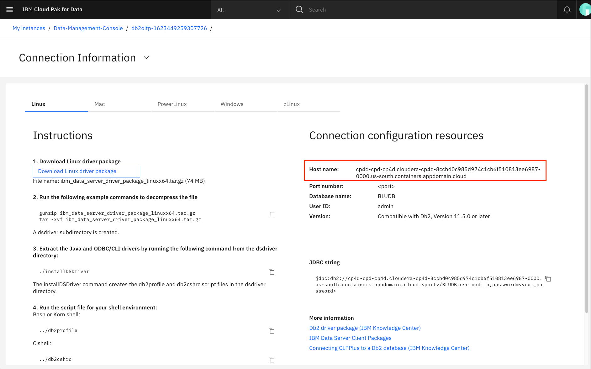

Transfer the data from these panels into the new connection panel and click `Test` to ensure it works.

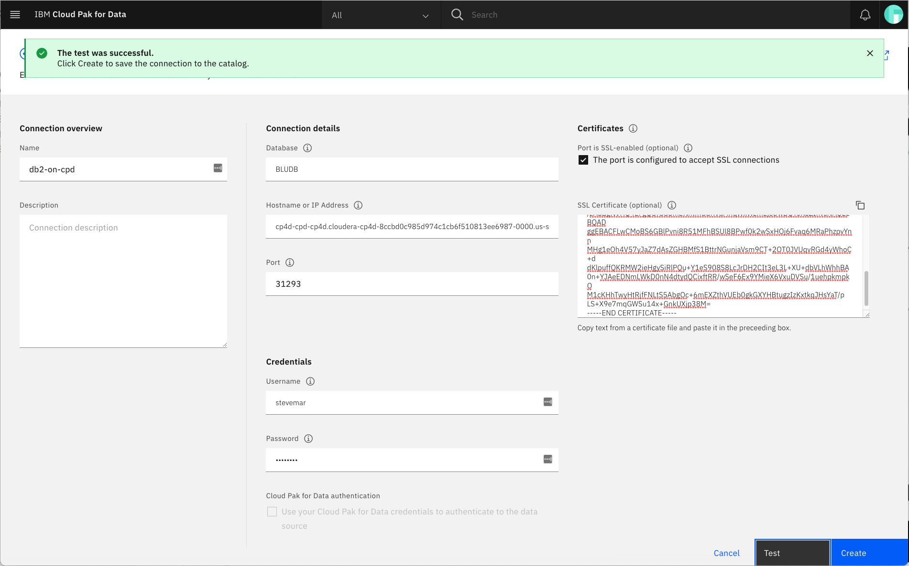

* Enter unique name for the connection `Name`.
* `Database` name can be found in panel 1.
* `Hostname` can be found in panel 2.
* `Port` can be parsed from the JDBC Connection URL (SSL) found in panel 1.
* `Username` and `Password` are your Cloud Pak for Data credentials.
* `SSL certificate` can be downloaded from panel 1.

Click `Create` to create the connection.

## 5. Load data on Cloudera Data Platform

On the Cloudera side, we will use Hive to populate our Hadoop tables. In our example, the data will be related to products (brand, description, price, ID, etc.).

First we need to do some setup to connect to our Hive service.

* Download the hive configuration file by selecting the `Download Client Configuration` option listed under the `Actions` drop-down menu for our Cloudera `Hive on Tez` service.

    

  This action will download a Hive configuration zip file. Unzip the file, then `cd` into the `hive-conf` directory to locate the `beeline-site.xml` file.

  Open the file and find the URL associated with the property `beeline-hs2-jdbc-url-hive_on_tez`. Copy and paste this value and then exit the file.

* Log into one of the master nodes in your CPD cluster.

  Start the beeline CLI by typing:
  
  ```bash
  beeline
  ```

  >**NOTE**: The authentication process will depend on how you configured your CPD Private instance.
  
  Connect to the Hive service by typing:
  
  ```bash
  !connect <jdbc-url>  // For `jdbc-url`, use the value copied from the previous step
  ```

* Use the following SQL commands to create a new database and tables.

  ```bash
  CREATE DATABASE great_outdoors;
  USE great_outdoors;
  CREATE TABLE products (
    `Product_number` INT,
    `Product_line` STRING,
    `Product_type` STRING,
    `Product` STRING,
    `Introduction_date` STRING,
    `Product_brand` STRING,
    `Product_color` STRING,
    `Product_size` STRING,
    `Product_description` STRING,
    `Unit_cost` STRING,
    `Unit_price` STRING)
    row format delimited fields terminated by ','
    STORED AS textfile TBLPROPERTIES('transactional'='false');
  ```

* Move [product CSV file](data/Products.csv) to your user HDFS home directory on the master node and then use Hive to insert the records.

  ```bash
  LOAD DATA INPATH '/<user-dir>/Products.csv' OVERWRITE INTO TABLE products;
  ```

<<TODO: need the actual SQL statement used>>
<<TODO: how is schema set? - GREAT_OUTDOORS_DATA>>

## 6. Use IBM BigSQL to synchronize data from Hive table into Cloud Pak for Data

Make sure you have the `Big SQL` service installed on your CPD cluster.

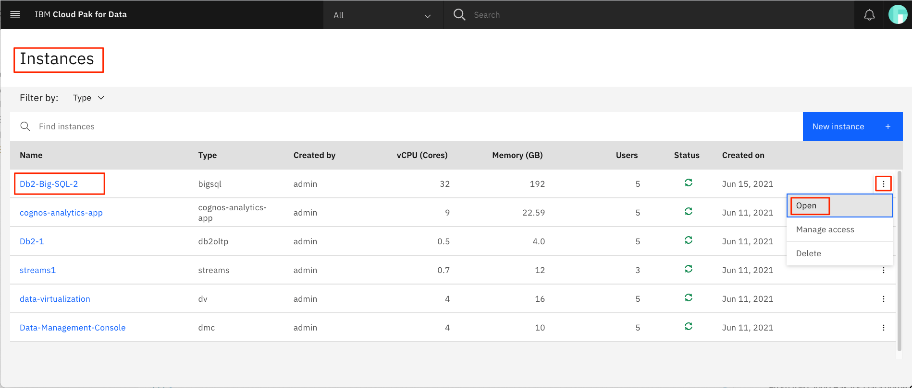

Open the `Big SQL` service by clicking on `Open` in the action menu.

`Summary` dropdown -> `Run SQL`

`Create new +`

```bash
CALL SYSHADOOP.HCAT_SYNC_OBJECTS('great_outdoors_2', 'products', 't');
```

`Run all`
`Close` (without saving)  WHY????

`Run SQL` dropdown -> `Explore` -> `Hadoop tables`

Click on `GREAT_OUTDOORS_2` schema. Then click on `PRODUCTS` table.

Verify data is all there.

<<TODO: this whold big SQL setup did not work for me - getting CPD errors>>

### Create JDBC Connection

Platform Connections

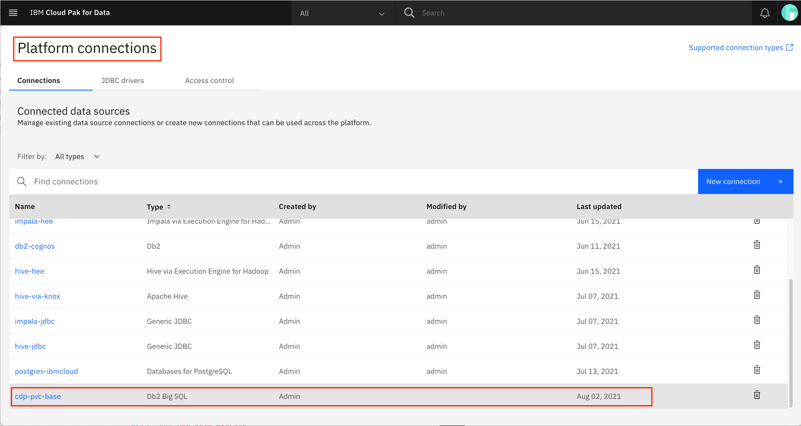

Click on the connection name to bring up the details panel.

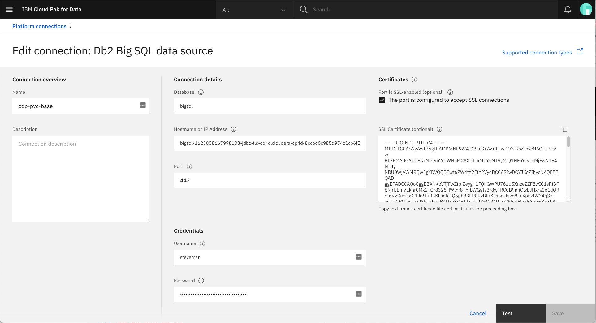

To determine host name, follow the procedures outlined in the [Setting up a connection to Db2 Big SQL](https://www.ibm.com/docs/en/cloud-paks/cp-data/3.5.0?topic=sql-setting-up-connection-db2-big) instructions. We used the second suggested method - "Passthrough secure route method". The result was a route that we could use for the `Hostname or IP Address` field.

The documentation also suggests setting the `Port` value to 443.

For `Username` and `Password` use your CPD credentials.

For SSL certificate, you must run an `OpenSSL` command to the hostname just generated.

```bash
openssl s_client -showcerts -servername <hostname without port> -connect <hostname:port> 
```

This will return a chain certificate, so you will need to copy both and paste into the SSL certificate field. Note, be sure to remove any extraneous lines outside of the `BEGIN` and `END` certificate delimiters.

Click the `Test` button to ensure the connection works.

<<TODO: add screenshot>>

## 7. Use Data Virtualization to merge data from Cloudera and Cloud Pak for Data

From the Cloud Pak for Data home page menu, open up the `Data` menu and click on `Data Virtualization`.

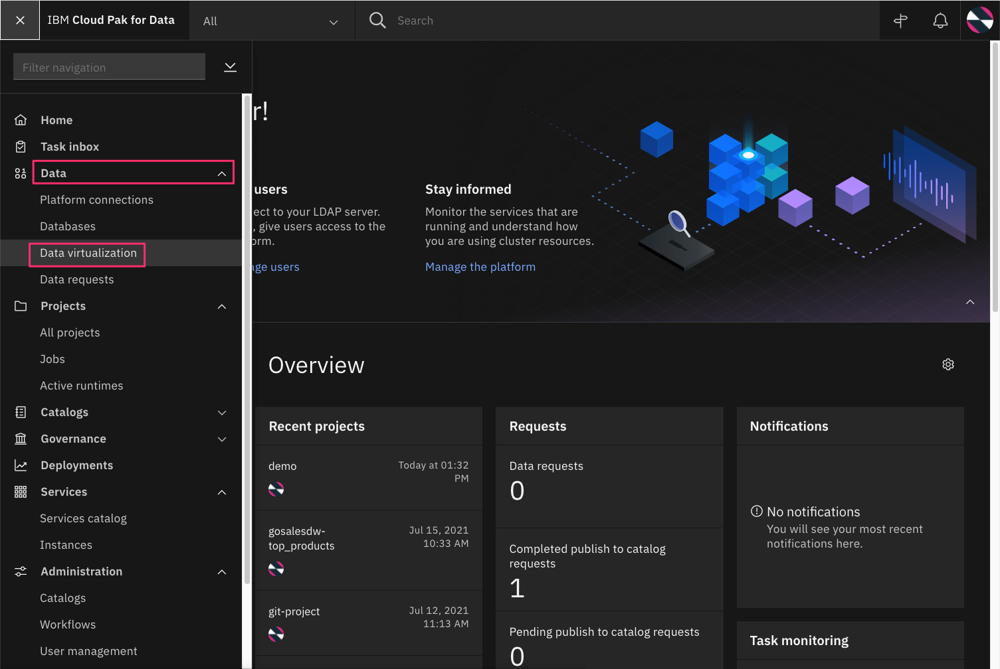

### Add data sources

The default landing page for `Data Virtualization` is `Data Sources`.

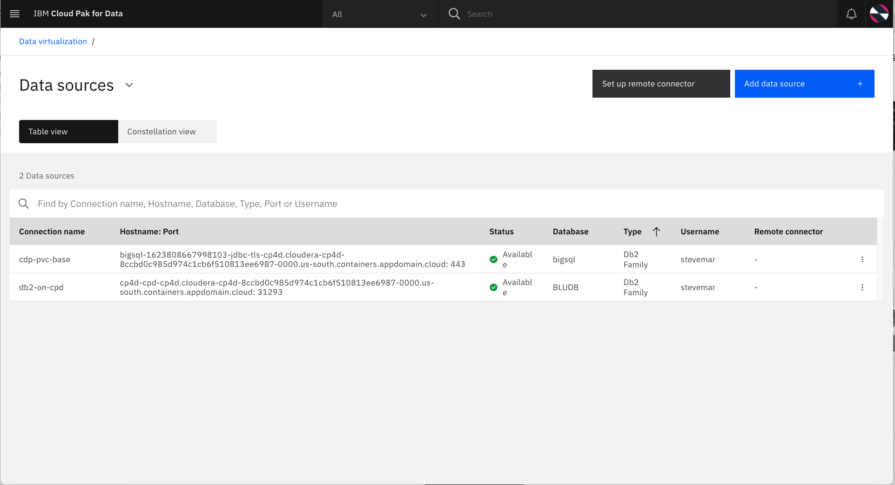

The `db2-on-cpd` connection we created to connect to the Hive database we created in the previous step. To create this connection, we clicked on the `Add data source` drop-down menu and then clicking on `Select existing connection`.

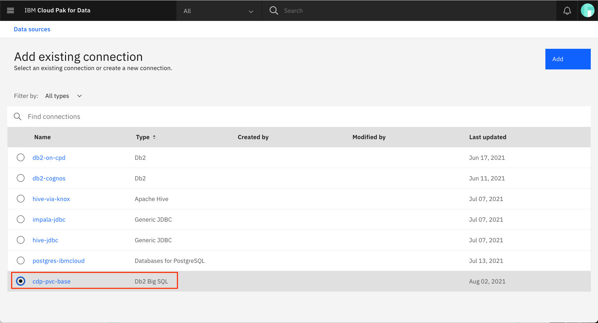

We then selected our `cdp-pvc-base` connection and clicked `Add`.

### Virtualize tables

From the main drop-down menu, click on `Virtualize`, which is listed under the `Virtualization` option.

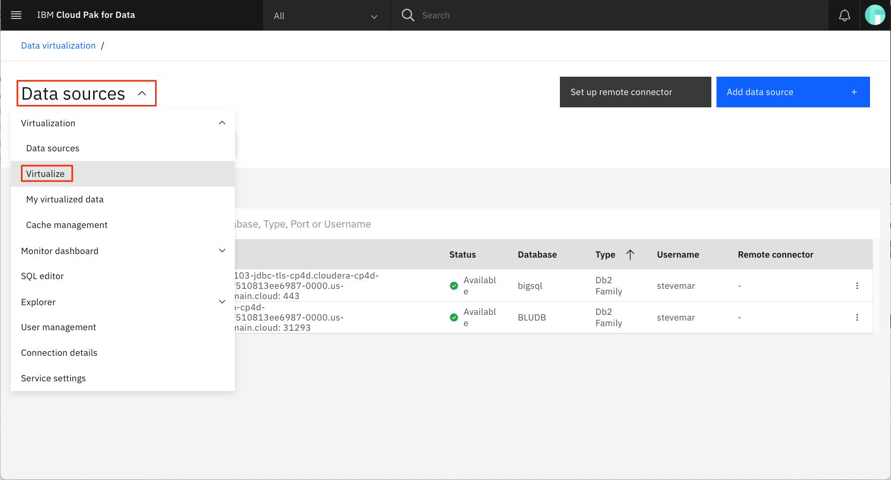

From the `Table` list, select each of the tables we have created, and add them to the `Cart`.

* The `SALES` table associated with the `db2-on-cpd` connection (data from Cloud Pak for Data):

    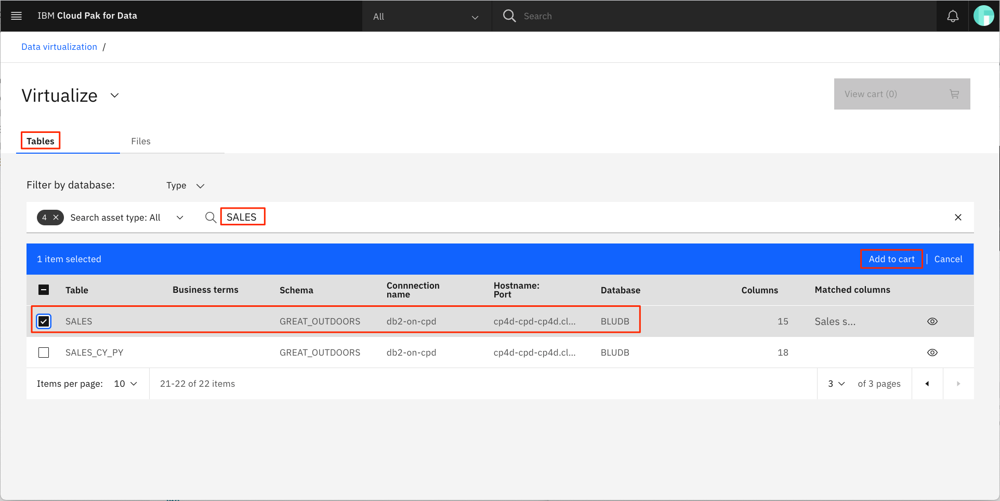

* The `PRODUCTS` table associated with the `cpd-pvc-base` connection (data from Cloudera Data Platform):

    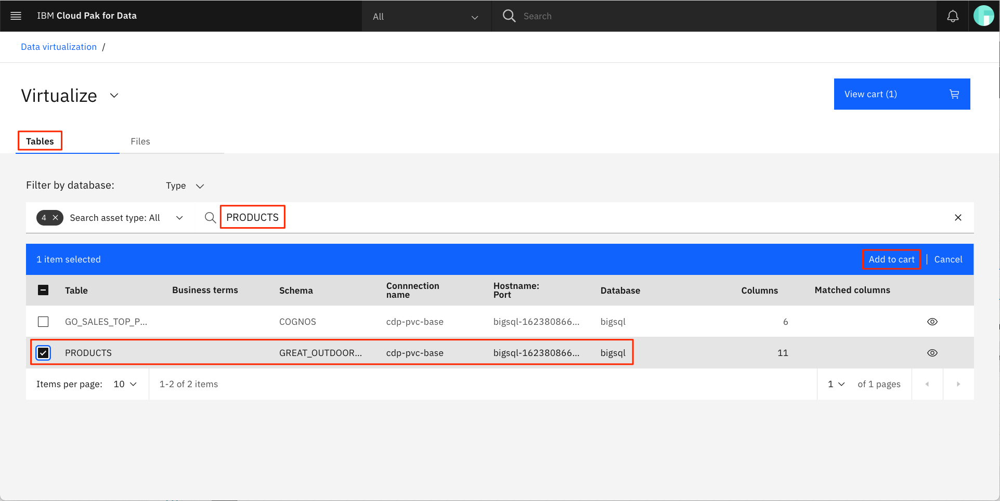


Click the `Add to cart` button.

Once available, click the `View cart` button.


Resolve any conflicts, assign to your CPD project, and then click `Virtualize`.

Once complete, click the `View my virtualized data` button on the modal dialog.

NOTE: You can also navigate to your data by clicking on the `My virtualized data` option from the main Data Virtualization menu.

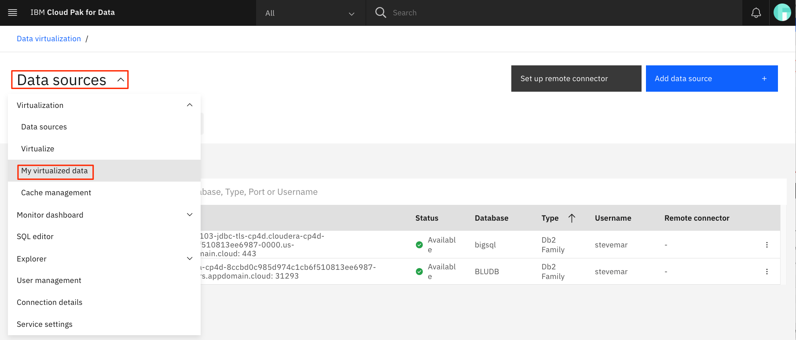

You should now see your new virtualized data tables listed.

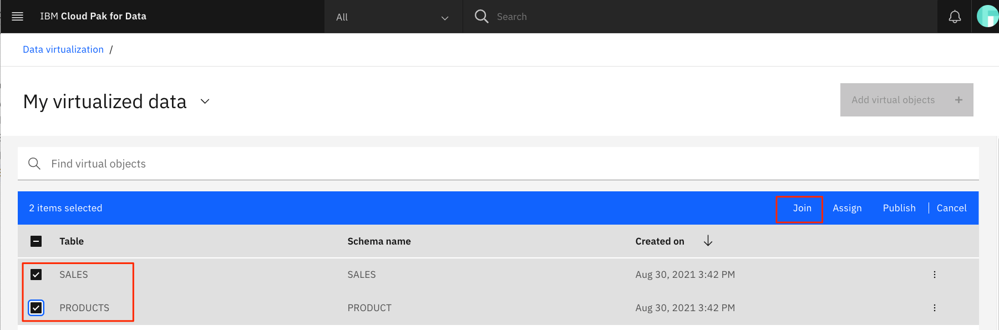

### Join tables

Select the Sales and Products tables, then click the `Join` button in the table header.

We won't need all of the columns for our join, so start by de-selecting all of the column names.

The columns we are interested in are:

Products table: `PRODUCT_NUMBER`, `PRODUCT`, `PRODUCT_TYPE`
Sales table: `Product number`, `REVENUE`, `Gross profit`

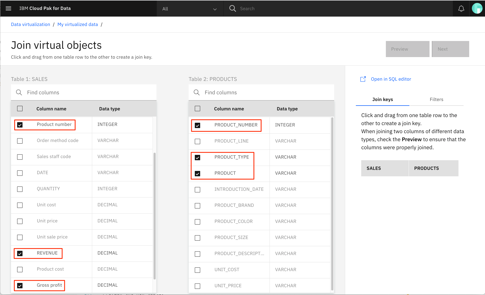

Connect the primary keys together by clicking in the `Product number` row in the `Sales` table, and drag and drop the cursor onto the `PRODUCT_NUMBER` row in the `PRODUCTS` table.

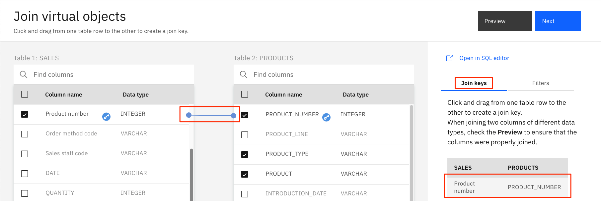

If successful, the table in the right hand margin should reflect the joining of the keys.

Click the `Open in SQL editor` button at the top of the right hand margin.

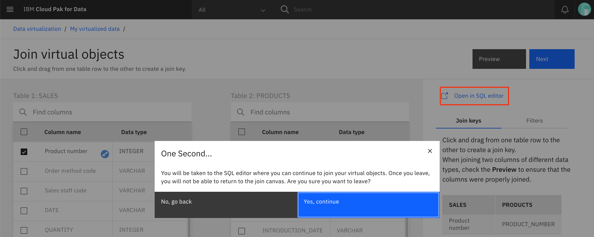

In the editor window, you will see the SQL statement that was generated from the actions from the previous step. We will need to modify this slightly so that we get total `SUM` values for revenue and gross profit. The `GROUP BY` statements allow us to generate the sums. Note that we are also changing the view name.

```sql
CREATE VIEW highest_revenue_products
AS
SELECT
    "PRODUCTS"."PRODUCTS"."PRODUCT_NUMBER" AS "PRODUCTS_PRODUCTS_PRODUCT_NUMBER",
    "PRODUCTS"."PRODUCTS"."PRODUCT" AS "PRODUCTS_PRODUCTS_PRODUCT",
    "PRODUCTS"."PRODUCTS"."PRODUCT_TYPE" AS "PRODUCTS_PRODUCTS_PRODUCT_TYPE",
    SUM("SALES"."SALES"."REVENUE") AS "SALES_SALES_REVENUE",
    SUM("SALES"."SALES"."Gross profit") AS "SALES_SALES_Gross profit"
FROM
    "PRODUCTS"."PRODUCTS",
    "SALES"."SALES"
WHERE
    "PRODUCTS"."PRODUCTS"."PRODUCT_NUMBER" = "SALES"."SALES"."Product number"
GROUP BY 
    "PRODUCTS"."PRODUCTS"."PRODUCT_NUMBER",
    "PRODUCTS"."PRODUCTS"."PRODUCT",
    "PRODUCTS"."PRODUCTS"."PRODUCT_TYPE",
    "SALES"."SALES"."REVENUE",
    "SALES"."SALES"."Gross profit"
```

Click the `Run all` button to execute the SQL.

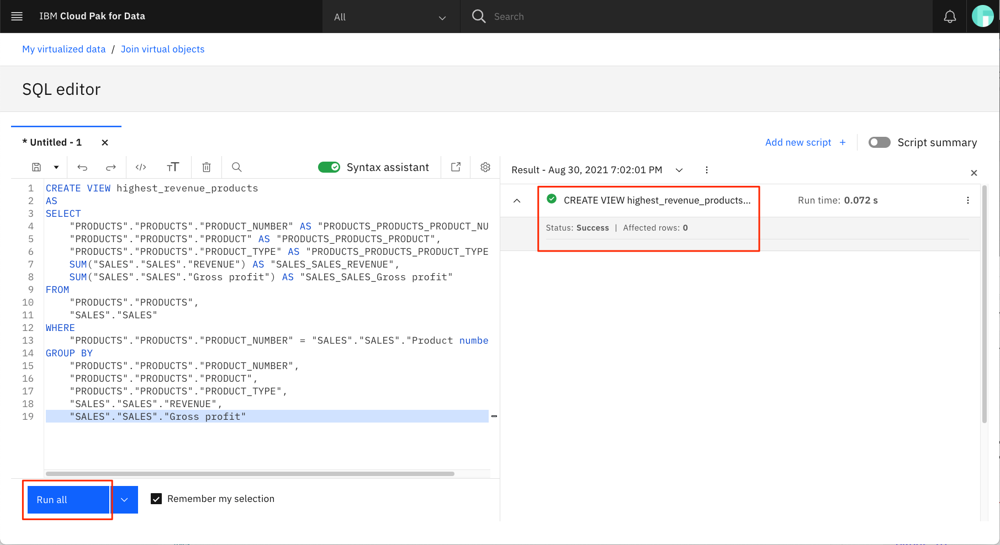

### New view

To see our new view, navigate back to the `My virtualized data` panel. You should now see the new view.

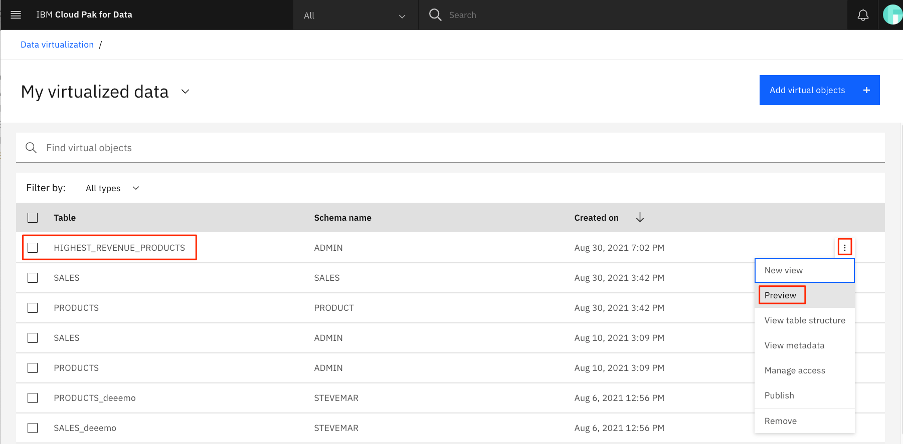

Use the action menu for the view to select the `Preview` option.

<<TODO: screen shots of new view. I got CPD errors>>

## 8. Build Cognos Analytics dashboard to visualize merged data

<<TODO: Cognos section is WIP>>

To use Cognos Analytics, we will need to connect to `Big SQL` to access the Hive data on our Cloudera cluster. Grab the port number for our `Big SQL` instance from the Red Hat OpenShift console:

<<TODO: add screen shot. And how do we connect to OpenShift?>>
PORT: 32052

### Launch Cognos Analytics instance

From the CPD `Instances` panel, locate the Cognos Analytics service, then click on `Open` from the action menu.

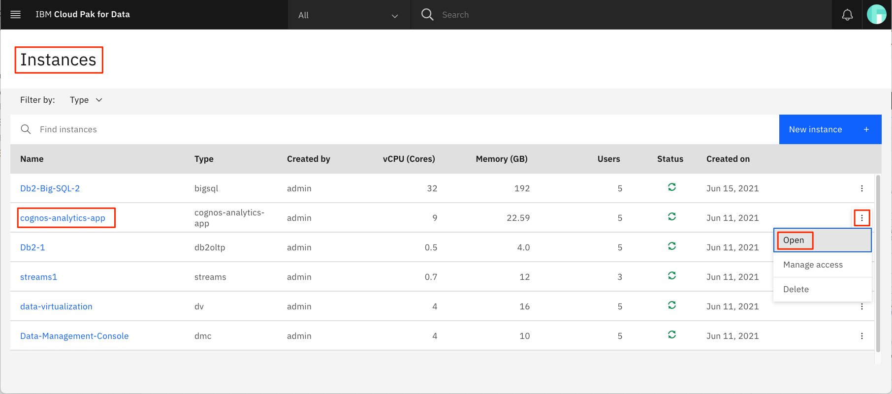

This will bring up the Cognos Analytics service home page.

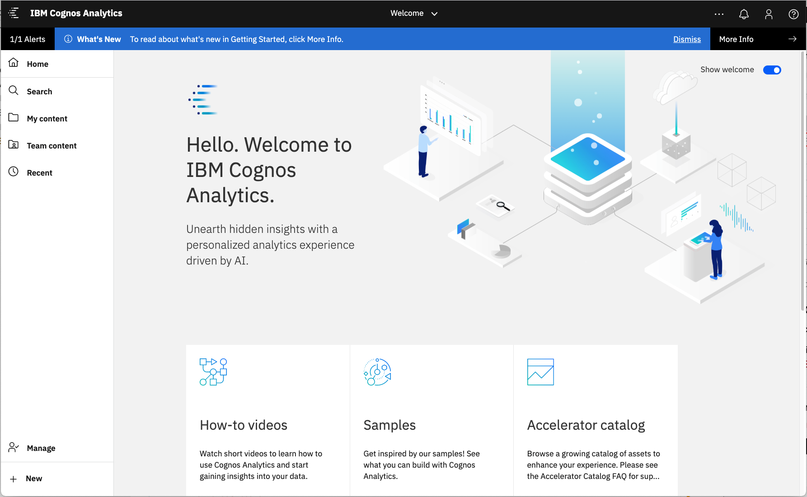

### Add Big SQL connection

To navigate to the `Big SQL` connection panel, start by clicking on the `Manage` option from the main menu. From the `Data server connections` panel, clicking the `+` button to create a new connection.

From the `Type` list, select `IBM Big SQL`.

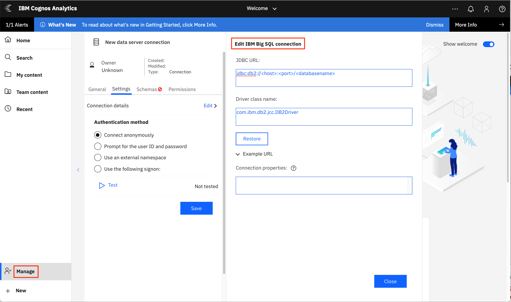

Set up URL to connect to data virtualization service on CPD

You will need to enter uname/pwd to complete

Load schema and metadata

### Create data module

Use data source just added

Select table that we want: HIGHEST_REVENUE_PRODUCTS

Save data module

### Build dashboard

Drag SALES_REVENUE
Add PRODUCT_TYPE

Change scatter plot to tree map

## Associated Videos

<<TODO: REMOVE before release>>

1. Set up Active Directory Server on Windows 2019 Server
    - needed for Cloudera Data Platform
    - services include Active Directory Domain Services and DNS server
    - uses private DNS domain (cdplab.local)
    - add DNS entries for each VM in CDP cluster (cid-vm-01.cpdlab.local to cid-vm-08)
2. Use Ansible playbooks to create Cloudera Private Cloud on VMs created in IBM Cloud
3. Setup edge nodes (07 & 08) so we can install Hadoop Execution Engine (HEE)
4. Configure Cloudera so we can install HEE on edge nodes
    - need to configure HIVE because HEE install calls the HIVE server
    - use RPM to yum install HEE on edge nodes
    - use CPD Platform configuration tab to integrate with edge nodes
5. Configure CPD Platform connections via HEE
    - for HDFS (requires webHDFS url, SSL cert for HEE). Named `hdfs-hee`.
    - for Hive (requires Hive JDBC41 driver, Hadoop Integration Service url, SSL cers for HEE and Hive server). Named `hive-hee`.
    - for Impala (requires Impala JDBC41 driver, link to Impala daemon running on Cloudera). Named `impala-hee`.
6. IBM Db2 on CPD
    - upload data (product data in csv)
    - create a Db2 connection (port 31293). Requires SSL cert.
    - connection is named `db2-on-cpd`
7. Hive
    - connect to Hive using command line
    - use Hive on Tez service found on Cloudera
    - data will be on Cloudera
    - uses `beeline` CLI to create database, create table and load data from csv
8. Use BigSQL to synchronize data from Hive table into CPD
    - BigSQL in installed on CPD - named `Db2-Big-SQL-2`
    - To use virtualization, need to create a JDBC connection (port 443)
    - connection named `bigsql`
9. Use CPD Data Virtualization
    - "add existing connection" to point to connectors `bigsql` and `db2-on-cpd`
    - virtualize tables:
      - PRODUCTS (bigsql) (rename to PRODUCTS_HIVE to avoid conflict)
      - PRODUCTS (db2-on-cpd)
    - Join the 2 tables by mapping PRODUCT name
10. Cognos integration

## License

This code pattern is licensed under the Apache Software License, Version 2.  Separate third party code objects invoked within this code pattern are licensed by their respective providers pursuant to their own separate licenses. Contributions are subject to the [Developer Certificate of Origin, Version 1.1 (DCO)](https://developercertificate.org/) and the [Apache Software License, Version 2](https://www.apache.org/licenses/LICENSE-2.0.txt).

[Apache Software License (ASL) FAQ](https://www.apache.org/foundation/license-faq.html#WhatDoesItMEAN)
